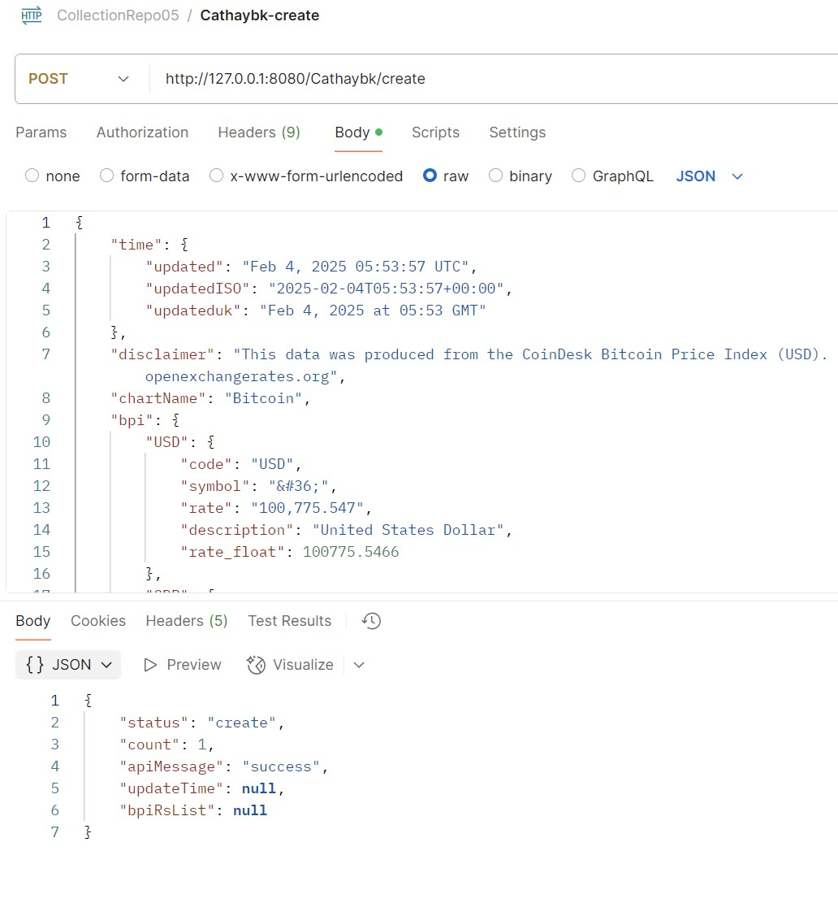
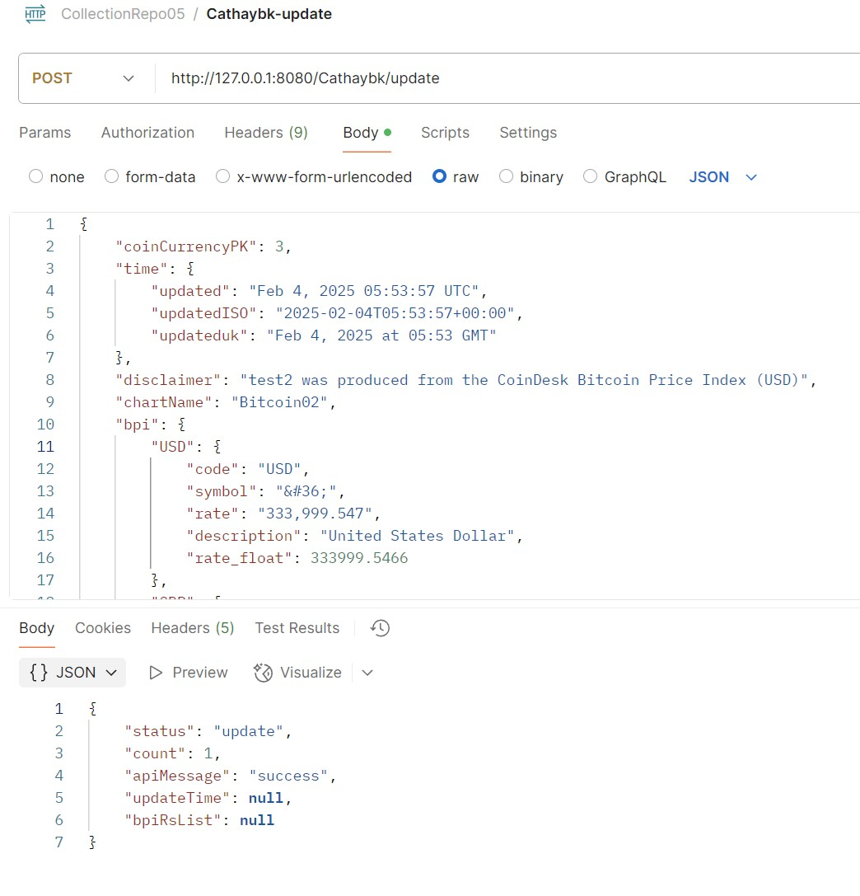
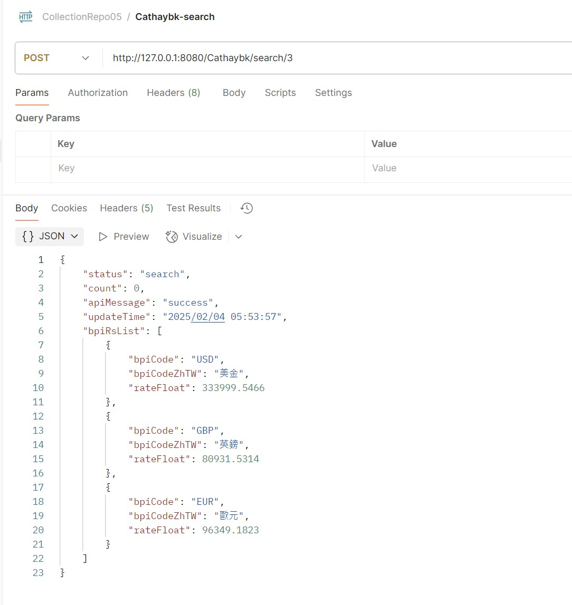
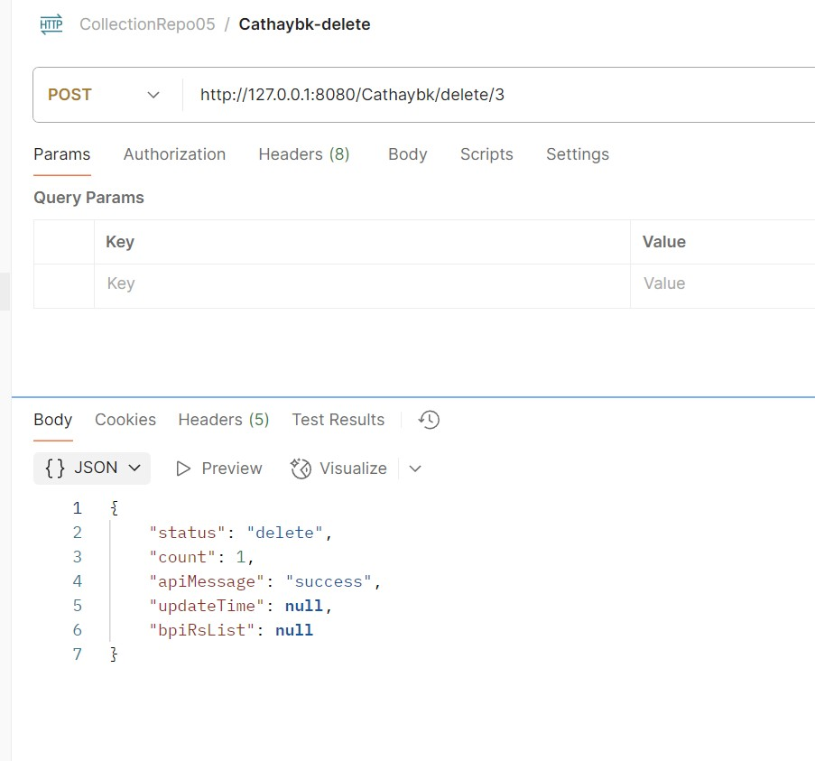

# CathaybkExam01

```no-highlight
預前準備

1. 安裝 H2資料庫，新增 demo01 database ，
新增 demo01Test database 。


2. 新增『src\main\resources\application.properties』檔案，
新增『src\test\resources\application.properties』檔案，
加入資料庫連線設定，
參數設定可參考『application.properties.local』檔案。

3. 啟動 H2資料庫，連線 「demo01 database」 跟 「demo01Test database」 輸入下述SQL指令 創建 資料庫表。
CREATE TABLE coin_currency(
    coin_currency_id INT NOT NULL AUTO_INCREMENT,
    updated_time VARCHAR(40),
    updatedISO_time VARCHAR(40),
    updateduk_time VARCHAR(40),
    disclaimer VARCHAR(200),
    chart_name VARCHAR(20),
    PRIMARY KEY(coin_currency_id)
);

CREATE TABLE bpi(
    bpi_id INT,
    code VARCHAR(10),
    symbol VARCHAR(12),
    rate VARCHAR(20),
    description VARCHAR(40),
    rate_float VARCHAR(20),
    FOREIGN KEY (bpi_id) REFERENCES coin_currency(coin_currency_id)
);

```

<br />
create API 測試結果<br />



<br />
update API 測試結果<br />



<br />
search API 測試結果<br />



<br />
delete API 測試結果<br />



<br />